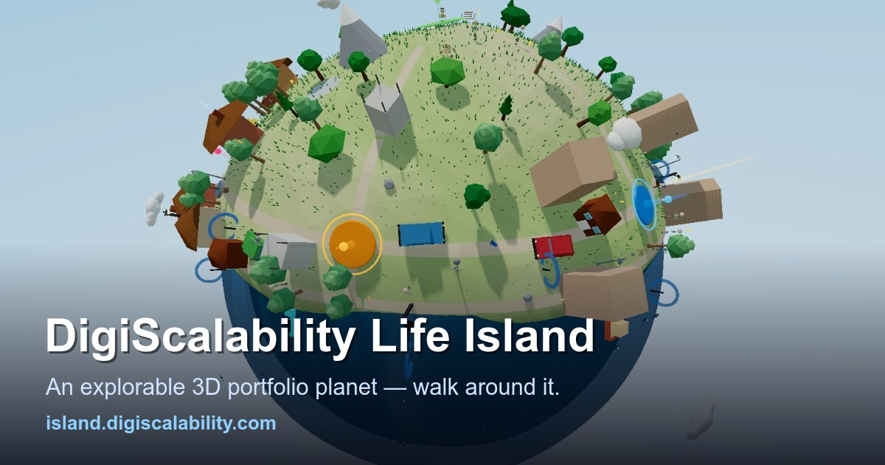

# DigiScalability Life Island

**Live: [island.digiscalability.com](https://island.digiscalability.com)**

A living 3D portfolio: a miniature planet you walk around as a third-person
character — five content districts, a working town of NPCs, multiplayer
presence, races, deliveries, and enterable buildings. Built by
[Abbas Ali](https://digiscalability.com) (Melbourne, AU), solo founder of
DigiScalability.



## The part nobody else has

Every townsperson is a **live AI agent**, and the island runs itself:

- **18 chat NPCs** — walk up and one greets you aware of the time of day and
  what it's doing; press E and talk to a server-side Claude persona (each with
  its own voice, schedule, and personality).
- **A daily AI planner** — every morning at 6am one small LLM call assigns the
  day's activities and event; a 60fps client engine executes them (gardening,
  patrols, mail rounds, music, lamp-lighting… NPCs walk home and sleep at night).
- **A nightly AI analyst** — at 9pm it aggregates real usage from the database,
  emails the owner a digest, and **files GitHub issues about its own island**
  ([see them](https://github.com/digiscalability/portfolio-island/issues?q=label%3Aisland-analyst)).
- **The Island Times** — an in-world newspaper the agents compile nightly,
  with a public 14-day archive.

### The safety invariant that makes this shippable

The LLM **never writes free prose to any world-visible surface**. It only
index-selects activity/event/notice IDs from pre-authored pools, validated
independently on the server and the client. Free prose is confined to
owner-only surfaces (email, GitHub issue bodies). Visitor chat text is treated
as data, never instructions; spend is metered per-month with hard caps, rate
limits, and moderation on both directions.

## Quick start

```bash
npm install
npm run dev        # Vite dev server on :5173
npm test           # vitest — 53 unit + parity tests
npm run build      # production build into dist/
npm run check      # typecheck + lint (zero-warning) + format check
```

**Controls:** WASD move · mouse look · Space jump · **E** interact ·
P photo mode · Esc closes panels.

## How the world is put together

The planet is a displaced sphere (radius 75) with elevation- and
district-tinted vertex colors. Five zone plazas sit evenly on the equator, so
the equator road is "Main Street" and the districts hang off it:

```
Welcome ─VILLAGE─ Professional ─ORCHARD─ Projects ─MARKET─ Personal ─COUNTRY─ Contact ─FOREST─ (loop)
```

Mountains, woods, and rolling hills fill the higher latitudes. Placement goes
through a shared spacing registry (`Island.claimDir`) with per-category
clearance and slope limits; everything samples the *displaced* terrain and
sinks slightly (bury-not-float) so nothing hovers. Buildings and cottages are
enterable — one reusable interior room hidden under the map, themed per
building, with free-walk collision.

## Architecture (live modules)

| Module | Role |
|---|---|
| `main-simple.ts` | App entry: boot, render loop, input→scene wiring, compass |
| `GameScene.ts` | Scene composition, colliders, NPC wander/activity engine, interiors |
| `Island.ts` | Planet generation: terrain, district layout, prop placement |
| `NpcActivities.ts` | Activity schedules + goal resolver (the 60fps half of the planner) |
| `NpcChat.ts` | Client bridge to the server NPC brain + aware greetings |
| `SimplePlayer.ts` | Sphere-walking physics (tangent/normal split), rigged glb |
| `OrbitCamera.ts` | Follow-behind camera (parallel-transported), collision |
| `Multiplayer.ts` | Realtime presence via Firebase RTDB |
| `SimpleUI.ts` | DOM HUD: panels, guestbook, Island Times, photo mode |
| `functions/src/` | Cloud Functions: `npcChat`, daily `planner`, nightly `analyst`, world `director`, `janitor`, lead email |

## Backend

Firebase — anonymous Auth + Realtime Database for presence, profiles,
guestbook, leaderboards; Cloud Functions (Node 22) hold the Anthropic key and
every guardrail. The client loads Firebase lazily, off the startup critical
path. Deploys: Vercel (client), `firebase deploy --only functions` (server).

## Asset pipeline

Models live in `public/assets/models/*.glb`, authored by Blender headless
scripts (see `README-asset-workflow.md`). Assets are joined to single meshes
with applied transforms; the whole model set ships as ~200KB of `.glb`.

## Built with

Three.js · TypeScript · Vite · Firebase · Anthropic Claude (Haiku for the
planner + chat, Sonnet for the analyst) — and the development itself was
pair-built with [Claude Code](https://claude.com/claude-code).
